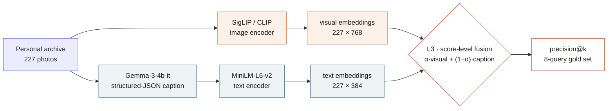
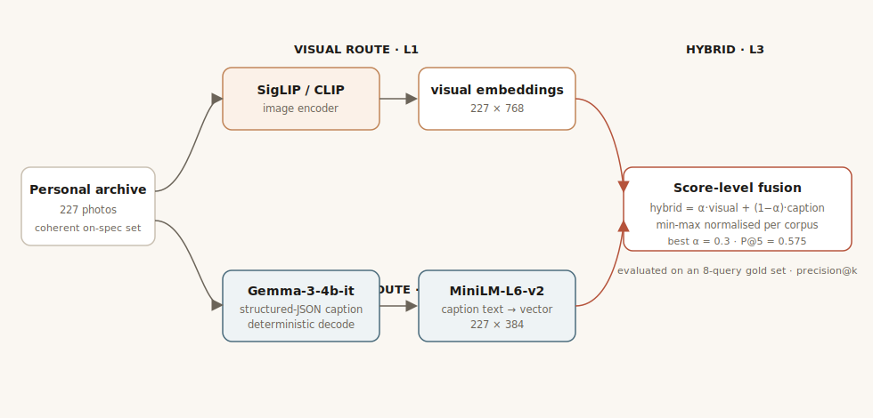
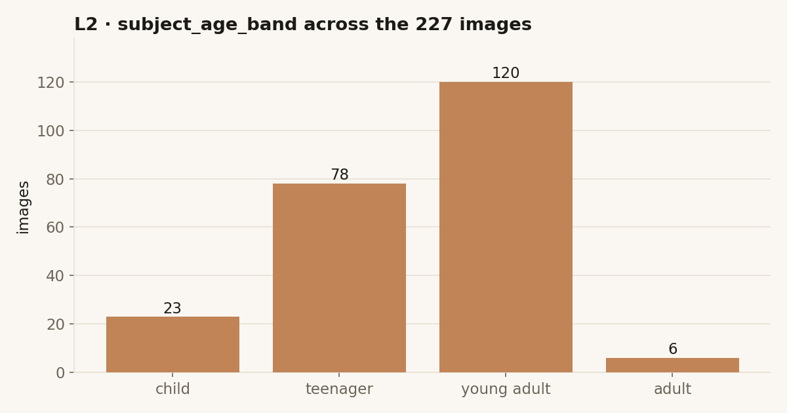
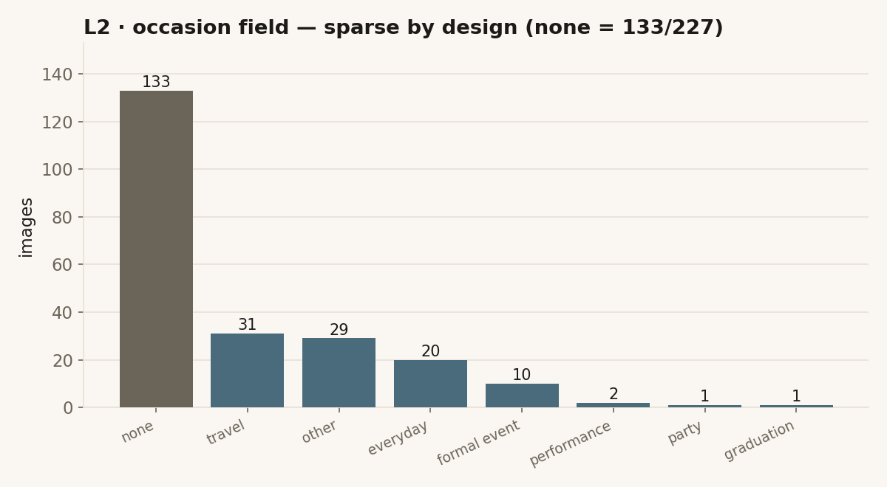
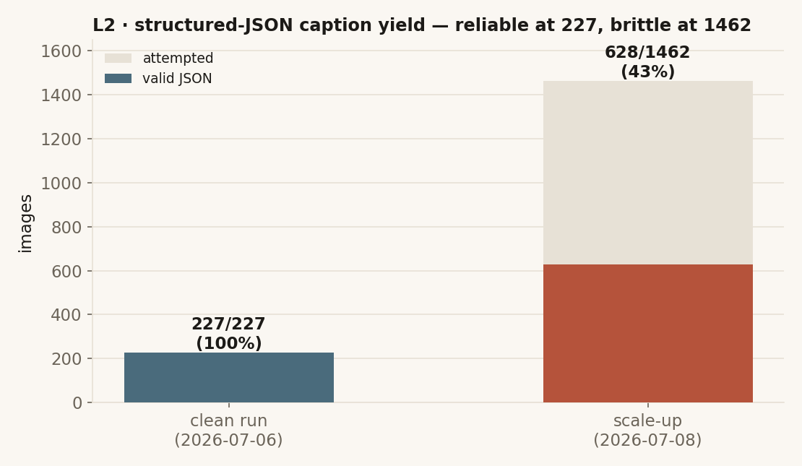
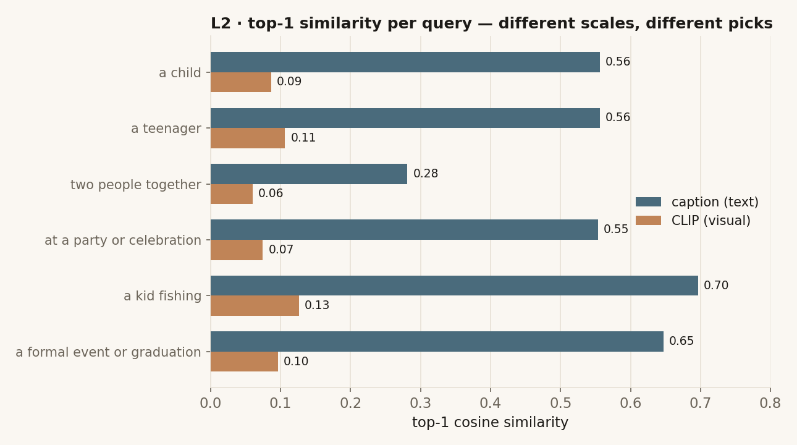
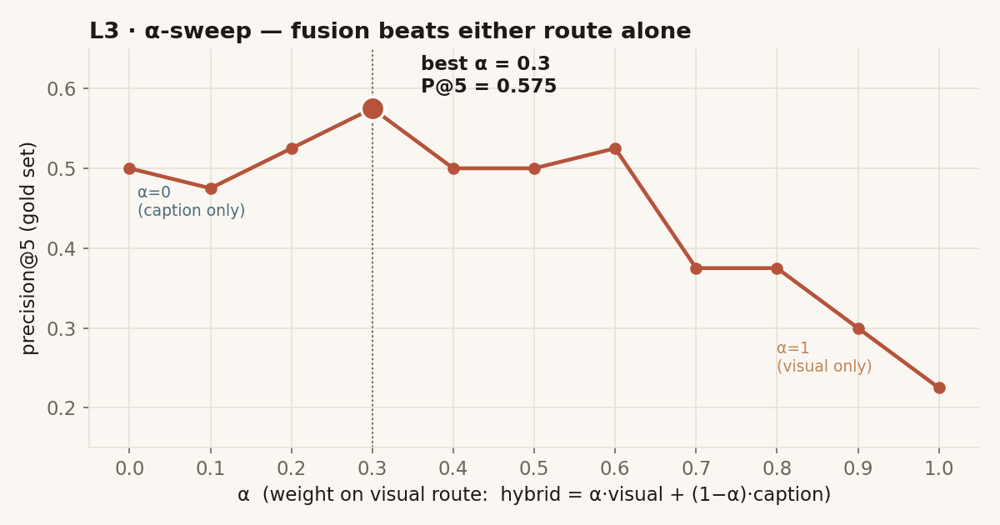
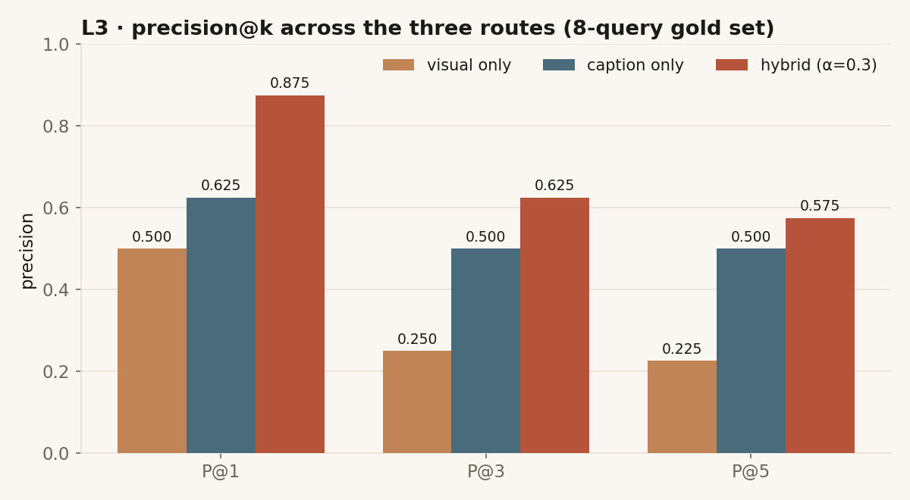
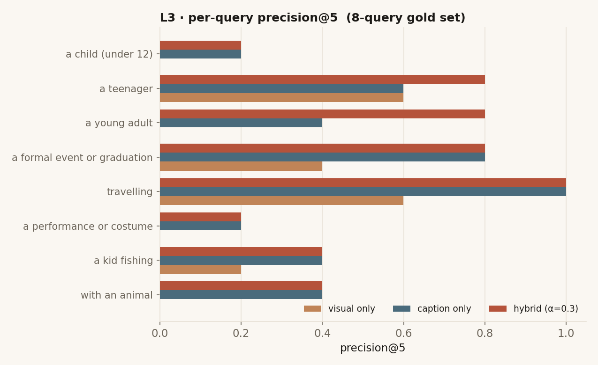

# Seeing Machines — Two Ways of Seeing, Then Both at Once (L1–L3)

> Teaching a machine to retrieve a life from a photo archive: first through pixels, then through words, then by fusing the two.

**Mateo Acevedo** · MA Design for Digital Futures, TH Nürnberg · CompSci for Designers 2, Summer 2026
**Stages:** L1 The Finder → L2 The Companion → L3 The Critic

📄 **Full write-up:** open [`index.html`](index.html) (all three levels, also publishable via GitHub Pages) or export it to PDF.

---

## Project arc

| Level | Name | What it builds | Headline result |
|---|---|---|---|
| **L1** | The Finder | SigLIP visual-similarity engine + a **15-query retrieval atlas** mapping where contrastive embeddings succeed and fail. | Concrete scenes work; identity, age, counting and relation fail. |
| **L2** | The Companion | Structured-JSON captioning (Gemma) → a second retrieval route over caption text → a **6-query head-to-head** vs the L1 visual baseline. | Caption route wins on semantic queries, but the two routes surface **different** images. |
| **L3** | The Critic | α-weighted **hybrid fusion** of both routes + multimodal answering + **precision@k** evaluation on an 8-query gold set. | Hybrid beats both routes at every k (P@1 **0.875**, P@5 **0.575**, best **α = 0.3**). |

---

## TL;DR

| | |
|---|---|
| **Corpus** | 227 images (coherent set: captions == CLIP == text, identical filenames, 0 stubs); one recurring subject, ~25 years |
| **Visual route (L1)** | `siglip-base-patch16-224` / CLIP image embeddings, `227 × 768` |
| **Semantic route (L2)** | `google/gemma-3-4b-it` structured-JSON caption → `all-MiniLM-L6-v2` text embeddings, `227 × 384` |
| **Hybrid route (L3)** | score-level fusion `α·visual + (1−α)·caption`, min-max normalised per corpus; **best α = 0.3** |
| **Evaluation (L3)** | precision@k on 8 gold queries → visual `0.225` · caption `0.500` · **hybrid `0.575`** (P@5) |

---

## L1 — The Finder (the visual baseline)

L1 embeds ~195 personal photos (1999–2023) once with **SigLIP** into a shared 768-d image–text space (L2-normalised, cached; retrieval on CPU via a Gradio app). The deliverable is a **retrieval atlas**: 15 queries with top-5 results, scores, and a mechanistic reading of each.

- **Concrete beats abstract** — `a kid fishing` (0.1265) and `riding a bicycle` (0.0998) are strongest; `two people together` (0.0598) is the weakest.
- **SigLIP encodes scenes, not identity or age** — `a child` / `a teenager` retrieve on composition and clothing, not facial age.
- **Counting and relations fail** — `two people together` is the atlas's one outright failure.
- **Scores compress into 0.03–0.13**, so **magnitude matters more than rank**; proposed retrieval **threshold ≈ 0.08**.

Every limitation becomes a requirement for L2 — which is why the same archive is then indexed a *second* way, through words.

---

## L2 — The Companion (the question)

When you type *“a kid fishing”* into a personal photo archive, what should the machine look at — **the picture**, or **a description of the picture**? L2 builds both routes over the same 227 images and puts them head-to-head.





Captions are constrained to a JSON schema — `one_line`, `subject_age_band`, `subject_appearance`, `subject_activity`, `companions`, `setting`, `occasion`, `objects`, `searchable_text` — and decoded with `do_sample=False`. The semantic route embeds `searchable_text`.

**Corpus shape.** The archive skews young-adult and teenage; `occasion = "none"` for 133/227 (the model is honestly reticent, so the occasion signal is sparse).




**The caption saga.** 0/0 (early parse bug) → **227/227** clean (2026-07-06) → **628/1462** on the scale-up. Coherence beats size; the polluted run is kept as evidence.



**Finding.** The caption route returns far higher similarities than CLIP, but the routes surface *different* images.



| query | route | top-1 |
|---|---|--:|
| `a kid fishing` → `2006_05_09_ (2).jpg` | both agree | CLIP 0.127 / caption 0.697 |
| `a formal event` → CLIP picks a studio image; caption picks the real ceremony (`DSC05207/02/09`) | routes disagree | 0.096 vs 0.65–0.61 |

> Neither route wins alone → motivates **L3 fusion**.

---

## L3 — The Critic (fusion + evaluation)

Because the routes live in different spaces (SigLIP 768-d vs MiniLM 384-d), they are fused at the **score level**: each similarity vector is min-max normalised over the corpus, then `hybrid = α·visual + (1−α)·caption`. The weight is swept, not guessed.



**Precision@k (8-query gold set):**

| route | P@1 | P@3 | P@5 |
|---|--:|--:|--:|
| visual only | 0.500 | 0.250 | 0.225 |
| caption only | 0.625 | 0.500 | 0.500 |
| **hybrid (α=0.3)** | **0.875** | **0.625** | **0.575** |



**Per-query — where hybrid helps, and where nothing does.** Fusion rescues age queries (`a young adult` 0.0/0.4 → **0.8**; `a teenager` 0.6/0.6 → **0.8**), ties the better route on `travelling` (1.0) and `a formal event` (0.8), and cannot save queries where both routes are already weak (`a child`, `a performance or costume`, `with an animal`).



**Multimodal grounding degrades predictably.** Passing retrieved images into Gemma at answer time is decisive for **1 image** (“purple walls and two bright geometric shapes”) but hedges at **4 images** (“I can't determine a single overarching setting… a variety of locations”). More visual context buys breadth, costs commitment.

> **Honesty note.** The gold set is *auto-derived from caption fields and filename dates, then eyeballed — not exhaustively hand-verified* (every `gold_queries.json` entry says so). Because caption/hybrid labels come from the same caption text they retrieve on, their scores are biased upward relative to visual. Eight queries show the ordering (hybrid > caption > visual) robustly, not tight confidence intervals.

---

## Repository layout

```
seeing-machines/
├── index.html                     # consolidated L1–L3 write-up (print to PDF for submission)
├── README.md                      # this file
├── HANDOFF.md                     # GitHub + Pages publishing steps
├── .nojekyll                      # lets Pages serve figures/ untouched
├── artifacts/
│   ├── captions.json              # clean 227 structured-JSON captions (shared L2/L3)
│   ├── l2_route_comparison.json   # 6-query CLIP-vs-caption top-3 results
│   ├── clip_embeddings.pkl        # 227 × 768 visual embeddings
│   ├── text_embeddings.pkl        # 227 × 384 MiniLM caption embeddings
│   ├── MANIFEST.json              # provenance across all three levels
│   └── l3/
│       ├── alpha_sweep.json       # α = 0.0→1.0, precision@5, best_alpha = 0.3
│       ├── evaluation_results.json# precision@{1,3,5} × 3 routes + per-query
│       ├── gold_queries.json      # 8 queries, relevant filenames (auto-derived)
│       └── multimodal_degradation.json  # 1-image vs 4-image answers
├── figures/
│   ├── pipeline.svg               # visual + semantic + hybrid pipeline
│   ├── age_distribution.png · occasion_distribution.png
│   ├── route_comparison.png · caption_saga.png            # L2
│   ├── alpha_sweep.png · precision_at_k.png · per_query_precision.png  # L3
│   └── make_figures.py            # regenerates ALL 7 PNGs from artifacts/
├── notebooks/
│   ├── L1_The_Finder.ipynb
│   ├── L2_The_Companion.ipynb
│   └── L3_The_Critic_FINAL.ipynb
├── docs/
│   └── dev_log.md                 # L1–L3 iteration history
└── corpus/
    └── README.md                  # access + consent note (add a 20-image sample/)
```

## Reproducing the figures

```bash
pip install matplotlib
python figures/make_figures.py   # regenerates all 7 PNGs from artifacts/
```

## Models & credits

`siglip-base-patch16-224` (L1 visual retrieval) · `google/gemma-3-4b-it` 4-bit (L2 captioning, L3 multimodal answering) · `sentence-transformers/all-MiniLM-L6-v2` (caption text). Corpus: personal photo archive — see [`corpus/README.md`](corpus/README.md) for access and consent.
